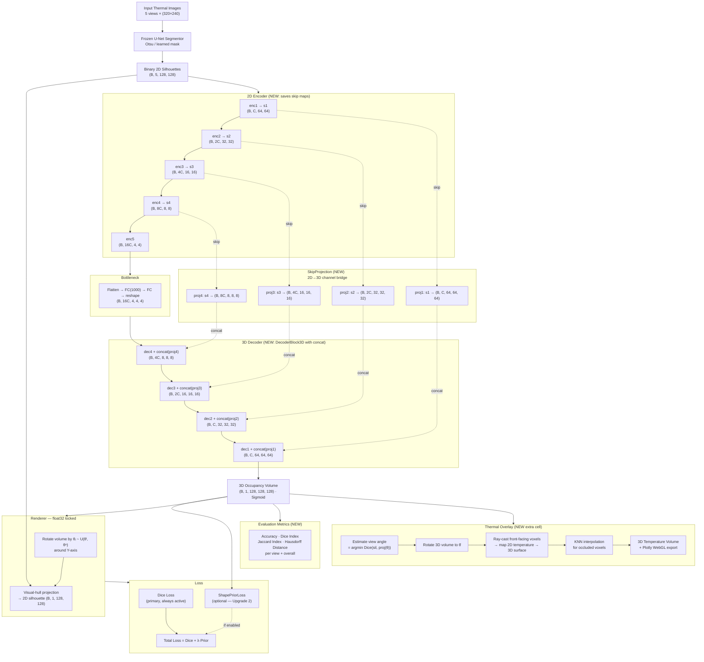

# Agent Prompt: BreastNet3D Architectural Upgrades
**Target file:** `UNET_Segmentation/3DBreastnet/breastnet3d_v4.ipynb`
**Repository:** `https://github.com/toomuchmarlboro/DNP-3DDMR-IR`

---

## Context You Must Read First

Before writing a single line of code, fetch and read the following files from the repository. Do not proceed without doing this — the existing implementation contains specific design decisions (FP32 rendering guard, 128³ volume, HD95 tracking, frozen U-Net segmentor) that all edits must respect.

Files to read:
- `UNET_Segmentation/3DBreastnet/breastnet3d_v4.ipynb` — the primary notebook being upgraded
- `README.md` — canonical view angle sign convention and data-flow description

Key facts extracted from those files that constrain every decision below:

- **Input tensor:** `(B, 5, H, W)` — five binary silhouette masks stacked along the channel axis, one per standard view.
- **Standard views and angles:** RL = −90°, RO = −45°, F = 0°, LO = +45°, LL = +90°. This convention is fixed. Do not change it.
- **Volume size:** 128 × 128 × 128 voxels. All spatial references in the code use this resolution.
- **Encoder:** 2D convolutional encoder with five down-sampling stages. Compresses input to a 1000-dimensional latent vector.
- **Decoder:** 3D transposed-convolutional decoder with five up-sampling stages. Expands latent code to the 128³ volume.
- **Rendering:** Differentiable visual-hull projection, locked to `float32` throughout. This guard exists to prevent NaN gradient collapse under mixed precision. Do not remove it.
- **Training loss:** Dice loss between rendered 2D projections and input silhouettes (self-supervised; no 3D ground truth).
- **Metrics tracked:** training Dice loss, validation Dice loss, validation Dice score, validation HD95.
- **Current validation Dice score:** approximately 0.84 on the held-out set.
- **Rotation axis:** Y-axis only. All projection views are obtained by rotating the volume around Y.
- **Checkpoint names:** `3dbreastnet_best.pth` and `3dbreastnet_last.pth`.

---

## Mission

Implement two targeted architectural upgrades inside `breastnet3d_v4.ipynb`. Each upgrade is a self-contained cell block. Neither upgrade should break the existing data pipeline, the FP32 rendering guard, the checkpoint-saving logic, the validation loop, or the thermal overlay section. All existing outputs (`training_history.png`, `.npy` volumes, `.json` angle files, asymmetry CSVs) must remain unaffected.

The two upgrades are:

1. **U-Net skip connections** — route encoder feature maps to their mirror decoder stages, bypassing the bottleneck.
2. **Soft dual-ellipsoid shape prior** — add a geometric penalty loss that discourages occupied voxels outside a breast-shaped envelope.

---

## Pipeline Flowchart



---

## Upgrade 1 — U-Net Skip Connections

### What the problem is

The existing encoder compresses five silhouette views down to a 1000-dimensional latent vector. Fine spatial boundary information (the inframammary fold, lateral contour curvature, medial asymmetry) is lost at this bottleneck and cannot be recovered by the decoder. The result is that reconstructed volumes have smooth but spatially imprecise boundaries.

### What you must build

Modify the model class (or define a new class `BreastNet3D_UNet` alongside the existing one) so that the output of each 2D encoder stage is stored and injected into its corresponding 3D decoder stage by concatenation along the channel dimension.

#### Dimension bookkeeping at 128³

At input resolution 128 × 128 with five down-sampling stages each using stride 2:

| Encoder stage | 2D spatial size | Decoder stage | 3D spatial size |
|---|---|---|---|
| enc1 | 64 × 64 | dec1 | 64³ |
| enc2 | 32 × 32 | dec2 | 32³ |
| enc3 | 16 × 16 | dec3 | 16³ |
| enc4 | 8 × 8 | dec4 | 8³ |
| enc5 | 4 × 4 | bottleneck | 4³ |

The encoder produces 2D feature maps `(B, C, H, W)`. The decoder expects 3D tensors `(B, C, D, H, W)`. You must bridge this dimensionality mismatch at every skip level.

#### How to bridge 2D encoder maps to 3D decoder maps

Use a learned projection module. For each encoder level `i`, define:

```python
class SkipProjection(nn.Module):
    def __init__(self, in_ch, out_ch, depth):
        super().__init__()
        self.depth = depth
        self.proj = nn.Sequential(
            nn.Conv3d(in_ch, out_ch, kernel_size=1, bias=False),
            nn.BatchNorm3d(out_ch),
            nn.ReLU(inplace=True),
        )

    def forward(self, feat_2d):
        # feat_2d: (B, C, H, W)
        # Expand to (B, C, depth, H, W) by repeating along depth
        feat_3d = feat_2d.unsqueeze(2).expand(-1, -1, self.depth, -1, -1)
        return self.proj(feat_3d)
```

Instantiate one `SkipProjection` per encoder level with the correct `depth` matching the decoder's spatial resolution at that level (4, 8, 16, 32, 64 from deepest to shallowest).

#### How to inject into the decoder

Each decoder up-sampling block should accept a `skip` argument. After up-sampling, concatenate the projected skip along the channel dimension, then pass through the 3D conv block:

```python
class DecoderBlock3D(nn.Module):
    def __init__(self, in_ch, skip_ch, out_ch):
        super().__init__()
        self.up = nn.ConvTranspose3d(in_ch, in_ch, kernel_size=2, stride=2)
        self.block = nn.Sequential(
            nn.Conv3d(in_ch + skip_ch, out_ch, kernel_size=3, padding=1, bias=False),
            nn.BatchNorm3d(out_ch),
            nn.ReLU(inplace=True),
            nn.Conv3d(out_ch, out_ch, kernel_size=3, padding=1, bias=False),
            nn.BatchNorm3d(out_ch),
            nn.ReLU(inplace=True),
        )

    def forward(self, x, skip):
        x = self.up(x)
        if x.shape[2:] != skip.shape[2:]:
            x = F.interpolate(x, size=skip.shape[2:],
                              mode='trilinear', align_corners=False)
        x = torch.cat([x, skip], dim=1)
        return self.block(x)
```

The interpolation guard handles rounding when the spatial dimension is odd; it must be present.

#### Bottleneck transition

The existing bottleneck flattens enc5 output, passes through `nn.Linear` to 1000 dimensions, then projects back to a 3D seed tensor `(B, C, 4, 4, 4)`. Keep this exactly as is. The skip connections operate around the bottleneck, not through it.

#### Channel budget

Keep the base channel count (`base_ch`) as whatever is currently set in `breastnet3d_v4.ipynb`. Do not increase it. The skip projections add channels only at concatenation points inside the decoder blocks, and the `DecoderBlock3D` `out_ch` absorbs them back down so that the output channel count per stage is unchanged relative to the baseline.

#### Checkpoint compatibility

Save the new model under a different key or file to avoid overwriting `3dbreastnet_best.pth` with an incompatible architecture. Use `3dbreastnet_unet_best.pth` and `3dbreastnet_unet_last.pth`.

#### Verification step

After building the model, add a single dry-run cell before training:

```python
model_unet = BreastNet3D_UNet(...).to(device)
dummy = torch.zeros(2, 5, 128, 128, device=device)
with torch.no_grad():
    out = model_unet(dummy)
assert out.shape == (2, 1, 128, 128, 128), f"Shape mismatch: {out.shape}"
print("U-Net model forward pass OK:", out.shape)
```

Do not proceed to training if this assertion fails.

---

## Upgrade 2 — Soft Dual-Ellipsoid Shape Prior *(Optional — implement only if requested)*

> **Status: SKIP FOR NOW.** Define the `build_dual_ellipsoid_prior` and `ShapePriorLoss` classes in their own cell so they are available for future use, but do **not** wire them into the training loop yet. The training loop must use Dice loss only until Upgrade 2 is explicitly enabled. Guard the integration point with a flag:
> ```python
> USE_SHAPE_PRIOR = False  # set True to activate Upgrade 2
> ```
> All content below describes the full implementation for when the flag is flipped.

### What the problem is

The existing loss function only penalises inconsistency between rendered projections and input silhouettes. It places no constraint on the physical plausibility of the 3D volume itself. The decoder can therefore produce occupied voxels in impossible locations — above the shoulder line, outside the lateral body contour, or in deep chest regions — whenever the Dice signal is ambiguous.

### What you must build

Build a static dual-ellipsoid mask in voxel space that represents the anatomically plausible region for breast tissue in a 128³ volume. Add a `ShapePriorLoss` module that penalises predicted occupied voxels that fall outside this mask. Add this penalty to the existing Dice loss during training.

#### Ellipsoid mask construction

```python
def build_dual_ellipsoid_prior(volume_size=128, device='cuda'):
    V = volume_size
    # Coordinate grids normalised to [0, 1]
    zz, yy, xx = torch.meshgrid(
        torch.linspace(0, 1, V, device=device),
        torch.linspace(0, 1, V, device=device),
        torch.linspace(0, 1, V, device=device),
        indexing='ij'
    )

    # Left breast centre (from patient's perspective, image left)
    cx_L, cx_R = 0.30, 0.70
    cy = 0.55   # slightly below vertical centre
    cz = 0.50

    # Semi-axes: tune these against your dataset if needed
    ax = 0.20   # horizontal spread per breast
    ay = 0.35   # vertical spread
    az = 0.28   # depth

    def ellipsoid_sdf(cx):
        return ((xx - cx)**2 / ax**2
              + (yy - cy)**2  / ay**2
              + (zz - cz)**2  / az**2)

    e_L = ellipsoid_sdf(cx_L)
    e_R = ellipsoid_sdf(cx_R)

    # Soft membership: sigmoid falloff at boundary
    # Values near 1 = inside ellipsoid union, values near 0 = outside
    prior = torch.sigmoid(8.0 * (1.0 - torch.minimum(e_L, e_R)))
    return prior.unsqueeze(0).unsqueeze(0)  # (1, 1, V, V, V)
```

Register this tensor as a buffer on the loss module so it moves with `.to(device)` and is never treated as a learnable parameter.

#### Loss module

```python
class ShapePriorLoss(nn.Module):
    def __init__(self, volume_size=128, device='cuda', weight=0.3):
        super().__init__()
        self.weight = weight
        prior = build_dual_ellipsoid_prior(volume_size, device).detach()
        self.register_buffer('prior', prior)

    def forward(self, V_pred):
        # V_pred: (B, 1, D, H, W), values in [0, 1]
        # Penalise mass that is occupied AND outside the prior region
        outside_mass = V_pred * (1.0 - self.prior)
        return self.weight * outside_mass.mean()
```

#### Integration into the training loop

The combined loss at each training step becomes:

```python
loss = dice_loss(rendered_proj, target_sil) + shape_prior_loss(V_pred)
```

The Dice loss call is unchanged. Only the addition is new. Log `shape_prior_loss.item()` separately in the same history dict that already tracks training Dice loss, so you can monitor whether the prior is active.

#### Hyperparameter guidance

Start with `weight=0.3`. If the validation Dice score drops by more than 2 percentage points compared to the baseline in the first 50 epochs, reduce weight to `0.1`. If the prior loss converges to near zero before Dice loss converges, increase weight to `0.5`. Document which value was used in a markdown cell above the training loop.

#### What the prior must NOT do

The ellipsoid is a soft regulariser, not a hard mask. It must not zero out voxels during inference. During inference (overlay reconstruction, angle estimation, Plotly export), `ShapePriorLoss` is not called at all — it only appears inside the training loop. Confirm this by checking that the inference cells below the training loop are untouched.

#### Verification step

Add a visualisation cell immediately after the prior construction:

```python
prior_np = build_dual_ellipsoid_prior(128, 'cpu').squeeze().numpy()
# Show the frontal slice (depth midpoint)
import matplotlib.pyplot as plt
plt.imshow(prior_np[64, :, :], cmap='hot', vmin=0, vmax=1)
plt.title('Dual-ellipsoid prior — frontal slice (depth=64)')
plt.colorbar()
plt.show()
# The plot should show two warm lobes side-by-side with soft edges
```

If the plot shows a single central blob or is all-zeros, the ellipsoid parameters are wrong. Fix before proceeding.

---

## Integration and Ordering Inside the Notebook

Add cells in this order. Do not reorganise existing cells.

1. **[NEW CELL — Definition]** `SkipProjection`, `EncoderBlock2D`, `DecoderBlock3D`, `BreastNet3D_UNet` class definitions.
2. **[NEW CELL — Definition]** `build_dual_ellipsoid_prior`, `ShapePriorLoss` class definition. *(Defined but not wired.)*
3. **[NEW CELL — Flag]** `USE_SHAPE_PRIOR = False` and any other runtime toggles.
4. **[NEW CELL — Verification]** Dry-run forward pass assertion for `BreastNet3D_UNet`.
5. **[NEW CELL — Verification]** Prior visualisation (frontal slice). *(Runs regardless of flag — visual sanity check only.)*
6. **[NEW CELL — Instantiation]** `model = BreastNet3D_UNet(...)`, conditional `shape_prior_loss = ShapePriorLoss(...)`, optimizer, scheduler (reuse existing settings).
7. **[MODIFIED CELL — Training loop]** Dice loss unchanged. Add `if USE_SHAPE_PRIOR: loss += shape_prior_loss(V_pred)`. Log `prior_loss` as `0.0` when flag is False.
8. **[NEW CELL — Plotting]** Loss curves: training Dice loss, validation Dice loss, and prior loss on the same figure.
9. **[NEW CELL — Evaluation metrics]** Compute Accuracy, Dice Index, Jaccard Index, and Hausdorff Distance on the validation/test set. See Evaluation Metrics section below.
10. **[NEW CELL — Thermal projection]** 3D temperature overlay cell. See Thermal Projection Cell section below.

All cells below item 10 (Plotly export, asymmetry CSV) must remain byte-for-byte identical to their current form, except for variable name changes forced by the new model name.

---

## Constraints and Anti-Patterns

These are hard stops. If any of the following would be required to implement the above, stop and report the conflict rather than proceeding.

- Do not remove the `float32` casting guard in the renderer. Mixed-precision rendering caused NaN gradient collapse in earlier versions of this notebook (see `FailedExperiments/` in the repo). The guard stays.
- Do not change the volume size from 128³ to any other value.
- Do not change the five-view angle convention (RL = −90°, RO = −45°, F = 0°, LO = +45°, LL = +90°).
- Do not replace the Dice loss with any other primary loss. The shape prior is additive, not a replacement.
- Do not introduce any dependency that is not already importable from the existing notebook environment (`torch`, `torch.nn`, `torch.nn.functional`, `numpy`, `matplotlib`, `skimage`, `plotly`, `scipy`).
- Do not modify the frozen U-Net segmentation model or its loading cell.
- Do not modify any cell that touches raw `.tiff` temperature files or the KNN interpolation for the thermal overlay.
- Do not modify the checkpoint-saving cell for the baseline model. Add a parallel save for the new model only.

---

## Acceptance Criteria

The upgrade is complete when all of the following are true.

- The dry-run cell runs without error and prints `U-Net model forward pass OK: torch.Size([2, 1, 128, 128, 128])`.
- The prior visualisation cell shows two distinct warm lobes positioned left-centre and right-centre of the 128 × 128 slice.
- The training loop runs for at least one full epoch without NaN in any loss value.
- `USE_SHAPE_PRIOR = False` leaves the training loss identical to the baseline Dice-only loss.
- After 50 epochs, validation Dice score is ≥ 0.84 (no regression from baseline). If below 0.84, check skip projection channel counts before any other change.
- The evaluation metrics cell prints a table with Accuracy, Dice Index, Jaccard Index, and Hausdorff Distance per view and overall.
- The thermal projection cell runs and saves a `thermal_overlay_<patient_id>.npy` file without error.
- `3dbreastnet_unet_best.pth` is saved when validation Dice score improves.
- The history dict contains keys: `train_dice_loss`, `val_dice_loss`, `val_dice_score`, `val_hd95`, `prior_loss`.

## Evaluation Metrics Cell

Add this as a standalone cell after the loss-curve plotting cell. It must run on the **independent test set** (or validation set if test set is not available), not on training data.

Compute the following four metrics for the 2D projections of the predicted 3D silhouette at each of the five standard view angles (−90°, −45°, 0°, +45°, +90°), then report per-view and overall averages. This directly reproduces Table 1 of the reference paper.

```python
import numpy as np
from scipy.spatial.distance import directed_hausdorff

def compute_metrics(pred_proj, target_sil, threshold=0.5):
    """
    pred_proj:   (H, W) float in [0, 1]  — rendered 2D projection
    target_sil:  (H, W) binary           — input silhouette
    Returns dict with Accuracy, Dice, Jaccard, Hausdorff.
    """
    pred_bin = (pred_proj >= threshold).astype(np.float32)
    tgt      = target_sil.astype(np.float32)

    TP = (pred_bin * tgt).sum()
    TN = ((1 - pred_bin) * (1 - tgt)).sum()
    FP = (pred_bin * (1 - tgt)).sum()
    FN = ((1 - pred_bin) * tgt).sum()
    N  = pred_bin.size

    accuracy = (TP + TN) / N
    dice     = (2 * TP) / (2 * TP + FP + FN + 1e-6)
    jaccard  = TP / (TP + FP + FN + 1e-6)

    # Hausdorff distance on contour point sets
    pred_pts = np.argwhere(pred_bin > 0).astype(float)
    tgt_pts  = np.argwhere(tgt  > 0).astype(float)
    if len(pred_pts) == 0 or len(tgt_pts) == 0:
        hausdorff = float('nan')
    else:
        hausdorff = max(
            directed_hausdorff(pred_pts, tgt_pts)[0],
            directed_hausdorff(tgt_pts,  pred_pts)[0]
        )

    return {
        'Accuracy':           accuracy,
        'Dice Index':         dice,
        'Jaccard Index':      jaccard,
        'Hausdorff Distance': hausdorff,
    }


# ── Evaluation loop ────────────────────────────────────────────────────────
model.eval()
view_names   = ['RL (−90°)', 'RO (−45°)', 'F (0°)', 'LO (+45°)', 'LL (+90°)']
std_angles   = [-90, -45, 0, 45, 90]
results_per_view = {v: [] for v in view_names}

with torch.no_grad():
    for masks, _ in test_loader:           # replace with your actual test DataLoader
        masks = masks.to(device)           # (B, 5, H, W)
        V_pred = model(masks)              # (B, 1, 128, 128, 128)

        for view_idx, (vname, angle) in enumerate(zip(view_names, std_angles)):
            proj = render_projection(V_pred, angle)          # your existing renderer
            proj_np = proj.squeeze(1).cpu().float().numpy()  # (B, H, W)
            sil_np  = masks[:, view_idx].cpu().numpy()       # (B, H, W)

            for b in range(proj_np.shape[0]):
                m = compute_metrics(proj_np[b], sil_np[b])
                results_per_view[vname].append(m)

# ── Print table ────────────────────────────────────────────────────────────
metric_keys = ['Accuracy', 'Dice Index', 'Jaccard Index', 'Hausdorff Distance']
print(f"{'View':<15} {'Accuracy':>10} {'Dice':>10} {'Jaccard':>10} {'Hausdorff':>12}")
print("-" * 60)
all_vals = {k: [] for k in metric_keys}

for vname in view_names:
    vals = results_per_view[vname]
    row  = {k: np.nanmean([v[k] for v in vals]) for k in metric_keys}
    for k in metric_keys:
        all_vals[k].extend([v[k] for v in vals])
    print(f"{vname:<15} {row['Accuracy']:>10.4f} {row['Dice Index']:>10.4f} "
          f"{row['Jaccard Index']:>10.4f} {row['Hausdorff Distance']:>12.4f}")

print("-" * 60)
overall = {k: np.nanmean(all_vals[k]) for k in metric_keys}
print(f"{'Overall':<15} {overall['Accuracy']:>10.4f} {overall['Dice Index']:>10.4f} "
      f"{overall['Jaccard Index']:>10.4f} {overall['Hausdorff Distance']:>12.4f}")
```

Expected output format (reference values from paper, Table 1):

| View | Accuracy | Dice Index | Jaccard Index | Hausdorff Distance |
|---|---|---|---|---|
| F (0°) | 0.9838 | 0.9889 | 0.9781 | 1.4142 |
| RO / LO (±45°) | 0.9583 | 0.9690 | 0.9400 | 4.5615 |
| RL / LL (±90°) | 0.9566 | 0.9484 | 0.9022 | 5.6180 |
| **Overall** | **0.9663** | **0.9688** | **0.9401** | **3.8646** |

These are the paper's reported values on 200 test participants at 64³ resolution. Your numbers will differ because your volume is 128³ and your model includes skip connections. They serve as a directional benchmark, not an exact target. Lateral views (±90°) consistently score lower than frontal — this is expected and reflects the reduced silhouette information at extreme angles.

---

## Thermal Projection Cell *(Extra cell — append after evaluation metrics)*

This cell implements Section 2.2.5 of the reference paper (Overlay). It maps the original 2D absolute temperatures from the input `.tiff` files onto the reconstructed 3D silhouette surface. It is a post-training inference cell; it does not participate in the training loop.

The existing `breastnet3d_v4.ipynb` already contains a version of this logic. This cell is a cleaned, self-contained reimplementation that makes the paper's algorithm explicit. If the existing cell already passes all acceptance criteria below, do not duplicate it — add only a markdown cell explaining how the existing implementation maps to the steps below.

```python
import torch
import numpy as np
from scipy.spatial import cKDTree

def estimate_view_angle(V_pred_np, sil_np, angle_range=(-90, 90), step=1):
    """
    Find the angle θ̂ that minimises Dice loss between the 2D silhouette
    and a projection of the 3D volume. Implements paper Section 2.2.5.

    V_pred_np: (D, H, W) float32 numpy occupancy volume (threshold at 0.5 first)
    sil_np:    (H, W) binary numpy silhouette for this view
    Returns estimated angle in degrees (float).
    """
    best_angle = 0
    best_loss  = float('inf')
    angles = np.arange(angle_range[0], angle_range[1] + step, step)

    V_t = torch.from_numpy(V_pred_np).unsqueeze(0).unsqueeze(0).float()  # (1,1,D,H,W)
    S_t = torch.from_numpy(sil_np).float()

    for angle in angles:
        proj = render_projection(V_t, angle).squeeze().numpy()            # (H, W)
        inter = (proj * sil_np).sum()
        loss  = 1 - (2 * inter) / (proj.sum() + sil_np.sum() + 1e-6)
        if loss < best_loss:
            best_loss  = loss
            best_angle = angle

    return best_angle


def overlay_temperatures_on_volume(V_pred_np, thermal_images, estimated_angles,
                                   volume_size=128):
    """
    Maps 2D temperature values from input thermal images onto the 3D silhouette.
    Implements the ray-cast overlay from paper Section 2.2.5.

    V_pred_np:        (D, H, W) binary occupancy volume
    thermal_images:   list of (H_orig, W_orig) float arrays — absolute temps (°C)
    estimated_angles: list of floats, one per view
    Returns 3D temperature volume (D, H, W) with NaN for unoccupied voxels.
    """
    D, H, W   = V_pred_np.shape
    temp_vol  = np.full((D, H, W), np.nan, dtype=np.float32)
    count_vol = np.zeros((D, H, W), dtype=np.float32)

    # Get occupied voxel coordinates
    vox_coords = np.argwhere(V_pred_np > 0.5).astype(np.float32)  # (N, 3) [d,h,w]

    for angle, temp_2d in zip(estimated_angles, thermal_images):
        if temp_2d is None:
            continue

        theta = np.radians(angle)
        cos_t, sin_t = np.cos(theta), np.sin(theta)

        # Rotate voxel coordinates around Y-axis (centre of volume)
        centre = np.array([D / 2, H / 2, W / 2])
        shifted = vox_coords - centre
        d, h, w = shifted[:, 0], shifted[:, 1], shifted[:, 2]

        # Y-axis rotation: x' = x·cos + z·sin, z' = -x·sin + z·cos
        w_rot =  w * cos_t + d * sin_t
        d_rot = -w * sin_t + d * cos_t

        # Keep only front-facing voxels (positive rotated depth → visible)
        # Normal vector check: retain voxels with d_rot > 0
        front_mask = d_rot > 0
        if front_mask.sum() == 0:
            continue

        # Pixel coordinates of front-facing voxels projected onto 2D plane
        h_pix = (h[front_mask] + centre[1]).astype(int)
        w_pix = (w_rot[front_mask] + centre[2]).astype(int)

        # Clamp to image bounds
        temp_h, temp_w = temp_2d.shape
        scale_h = temp_h / H
        scale_w = temp_w / W
        h_img = np.clip((h_pix * scale_h).astype(int), 0, temp_h - 1)
        w_img = np.clip((w_pix * scale_w).astype(int), 0, temp_w - 1)

        # Sample temperatures and accumulate into 3D volume
        orig_coords = np.argwhere(V_pred_np > 0.5)[front_mask]
        for i, (vd, vh, vw) in enumerate(orig_coords):
            t = temp_2d[h_img[i], w_img[i]]
            if not np.isnan(t):
                if np.isnan(temp_vol[vd, vh, vw]):
                    temp_vol[vd, vh, vw]  = t
                    count_vol[vd, vh, vw] = 1
                else:
                    # Running average for overlapping projections (paper Section 2.2.5)
                    temp_vol[vd, vh, vw]  = (temp_vol[vd, vh, vw] * count_vol[vd, vh, vw] + t)
                    count_vol[vd, vh, vw] += 1
                    temp_vol[vd, vh, vw]  /= count_vol[vd, vh, vw]

    # KNN interpolation to fill voxels not reached by any projection
    occupied_mask   = ~np.isnan(temp_vol) & (V_pred_np > 0.5)
    unoccupied_mask =  np.isnan(temp_vol) & (V_pred_np > 0.5)

    if occupied_mask.sum() > 0 and unoccupied_mask.sum() > 0:
        filled_coords = np.argwhere(occupied_mask).astype(np.float32)
        filled_temps  = temp_vol[occupied_mask]
        query_coords  = np.argwhere(unoccupied_mask).astype(np.float32)

        tree  = cKDTree(filled_coords)
        _, idx = tree.query(query_coords, k=1)
        temp_vol[unoccupied_mask] = filled_temps[idx]

    return temp_vol


# ── Run for one patient (adapt to your patient loop) ──────────────────────
patient_id  = 'example_patient_id'  # replace with actual ID variable
views_order = ['RL', 'RO', 'F', 'LO', 'LL']
std_angles  = [-90, -45, 0, 45, 90]

# Load the predicted volume for this patient
V_pred_np = np.load(f'outputs/{patient_id}_volume_soft.npy')  # (128, 128, 128)
V_bin     = (V_pred_np > 0.5).astype(np.float32)

# Load silhouettes and absolute temperature arrays
# (adapt to your actual data loading — use RAW .tiff values, not normalised tensors)
silhouettes = [...]        # list of 5 binary (128, 128) arrays
thermal_abs = [...]        # list of 5 float (H_orig, W_orig) arrays in °C

# Step 1: estimate view angles per view
estimated_angles = []
for view_idx in range(5):
    angle_est = estimate_view_angle(V_bin, silhouettes[view_idx],
                                    angle_range=(std_angles[view_idx] - 20,
                                                 std_angles[view_idx] + 20))
    estimated_angles.append(angle_est)
    print(f"View {views_order[view_idx]}: estimated angle = {angle_est:.1f}°")

# Step 2: overlay temperatures
temp_volume = overlay_temperatures_on_volume(V_bin, thermal_abs, estimated_angles)

# Step 3: save
np.save(f'outputs/{patient_id}_thermal_overlay.npy', temp_volume)
print(f"Thermal overlay saved: {temp_volume.shape}, "
      f"temp range [{np.nanmin(temp_volume):.1f}, {np.nanmax(temp_volume):.1f}] °C")
```

Acceptance criteria for this cell:
- `estimated_angles` for each view must fall within ±20° of the standard angle for that view. If any angle is outside this range, print a warning but do not raise an error.
- `temp_volume` must contain no NaN values inside the occupied region (`V_bin > 0.5`) after KNN interpolation.
- The saved `.npy` file must load without error and have shape `(128, 128, 128)`.
- Temperature values must be in a physically plausible range for breast thermography: 28°C to 38°C. Values outside this range indicate a raw-vs-normalised temperature mismatch — check that `thermal_abs` contains absolute temperatures, not min-max scaled values.

---

## Reference: Architecture the Paper Implemented (Baseline)

This is what `breastnet3d_v4.ipynb` currently implements, reconstructed from the README and paper. Use this as a diff baseline — every structural change you make must be explicitly justified against this description.

```
Input: (B, 5, 128, 128)           — 5 silhouette views, stacked channels

Encoder (2D):
  enc1: Conv2d(5,   C)  + BN + ReLU, stride 2  → (B, C,   64, 64)
  enc2: Conv2d(C,  2C)  + BN + ReLU, stride 2  → (B, 2C,  32, 32)
  enc3: Conv2d(2C, 4C)  + BN + ReLU, stride 2  → (B, 4C,  16, 16)
  enc4: Conv2d(4C, 8C)  + BN + ReLU, stride 2  → (B, 8C,   8,  8)
  enc5: Conv2d(8C, 16C) + BN + ReLU, stride 2  → (B, 16C,  4,  4)

Bottleneck:
  Flatten → Linear(16C*16, 1000) → ReLU
  Linear(1000, 16C*4*4*4) → reshape → (B, 16C, 4, 4, 4)

Decoder (3D):
  dec5: ConvTranspose3d(16C, 8C) → (B, 8C,   8,  8,  8)
  dec4: ConvTranspose3d(8C,  4C) → (B, 4C,  16, 16, 16)
  dec3: ConvTranspose3d(4C,  2C) → (B, 2C,  32, 32, 32)
  dec2: ConvTranspose3d(2C,  C)  → (B, C,   64, 64, 64)
  dec1: ConvTranspose3d(C,   C)  → (B, C,  128,128,128)

Output head:
  Conv3d(C, 1, kernel=1) + Sigmoid → (B, 1, 128, 128, 128)

Loss (self-supervised):
  Render 2D projections via visual-hull at random angles near each standard view
  Dice loss between projections and input silhouettes
  All rendering in float32
```

The upgrade adds skip connections from enc1–enc4 into dec1–dec4, and adds `ShapePriorLoss` to the scalar loss. Everything else is unchanged.
